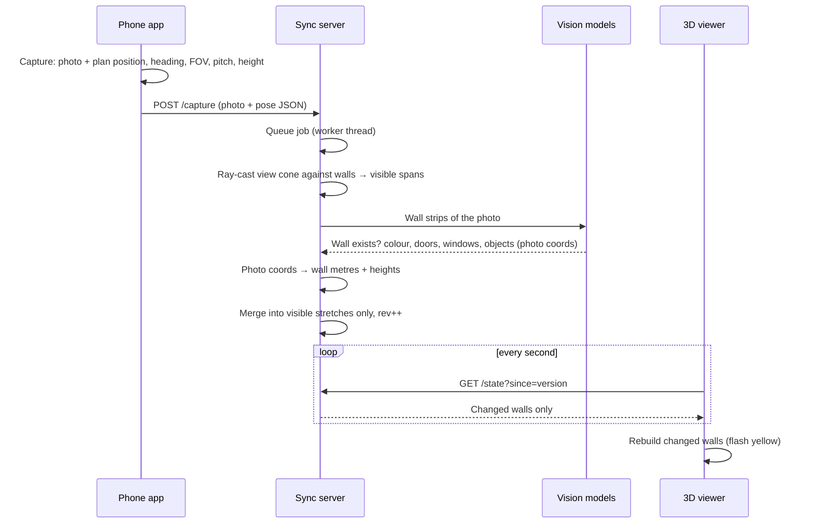

<div align="center">

# Spatial Sync

**Walk a floor plan into a live 3D digital twin.**

Load a 2D floor plan, walk the building with your phone, take photos.
Your path appears on the plan in real time, and every photo updates **only the walls it can see**
in a live 3D model. No 3D modelling, no scanning hardware, no training data.

`Unity 6` · `C#` · `AR Foundation / ARCore` · `Python` · `FastAPI` · `OpenCV` · `PyTorch` · `SegFormer` · `YOLOE`

</div>

---

## Table of contents

1. [The problem](#the-problem)
2. [What it does](#what-it-does)
3. [Demo walkthrough](#demo-walkthrough)
4. [Architecture](#architecture)
5. [How it works](#how-it-works)
6. [Tech stack](#tech-stack)
7. [Computer science concepts](#computer-science-concepts)
8. [Repository structure](#repository-structure)
9. [Getting started](#getting-started)
10. [Usage](#usage)
11. [Mapping a new floor plan](#mapping-a-new-floor-plan)
12. [Configuration reference](#configuration-reference)
13. [Server API](#server-api)
14. [Testing and verification](#testing-and-verification)
15. [Troubleshooting](#troubleshooting)
16. [Use cases](#use-cases)
17. [Limitations](#limitations)
18. [Roadmap](#roadmap)
19. [Licenses and credits](#licenses-and-credits)

---

## The problem

Almost every building has a 2D floor plan. Almost none have an accurate 3D model.

Creating one today means LiDAR scanners, photogrammetry rigs, or hours of manual work in a 3D modelling
tool, and the result is out of date as soon as a door is moved or a wall is repainted. Facility managers,
safety inspectors and first responders end up working from flat drawings that no longer match reality.

**Spatial Sync turns the floor plan you already have and the phone in your pocket into a 3D model that
stays in sync with the real building.**

## What it does

| | Feature | How |
|---|---|---|
| 🧱 | **Floor plan → 3D walls** | Classical computer vision detects walls, keeps doorways open, and estimates the scale from door widths |
| 📍 | **Live indoor tracking** | ARCore visual-inertial SLAM tracks you after one calibration tap at the entrance; your path is drawn on the plan |
| 📸 | **Spatially pinned photos** | Each photo drops a pin with a field-of-view cone showing where you stood and where the camera faced |
| 👁️ | **POV-only updates** | Ray casting finds exactly which walls, and which part of each wall, a photo sees; only those are updated |
| 🤖 | **Offline vision** | SegFormer segmentation + YOLOE open-vocabulary detection read walls, doors, windows, signs, extinguishers |
| 🏗️ | **Live 3D twin** | A Unity viewer rebuilds changed walls in seconds, with real door/window openings and photos projected onto walls |

## Demo walkthrough

1. **Plan in, walls out.** `python -m twin.cli walls --plan plan.png` traces every wall in red and prints the scale.
2. **Calibrate.** Stand at the entrance, face the agreed direction, tap **Calibrate**.
3. **Walk.** A blue line follows you on the floor plan on the phone.
4. **Capture.** Tap **Capture** in front of a wall. A pin with a view cone appears.
5. **Watch it sync.** Seconds later, in the 3D viewer, exactly the walls in that photo flash yellow and update:
   real colour, door and window openings, marked objects, and the photo projected onto the wall.
6. **Explore.** Orbit the model, or press **F** to walk through it in first person.

<!-- Add screenshots/GIFs here:
   -->

| Wall extraction | Which walls a photo sees | Segmentation on real photos |
|---|---|---|
|  |  |  |

## Architecture

Three programs communicate over HTTP on the same network:

| Component | Runs on | Built with | Responsibility |
|---|---|---|---|
| **Phone app** | Android phone | Unity 6, C#, AR Foundation + ARCore | Tracking, 2D map, live path, photo pins, uploads |
| **Sync server** | Laptop | Python, FastAPI, OpenCV, PyTorch | Wall extraction, visibility, vision models, model state |
| **3D viewer** | Laptop | Unity 6, C# | Builds and live-updates the 3D walls |

### Life of one photo



## How it works

### 1. Floor plan → wall segments
`server/twin/walls.py`

* **Binarise** with Otsu thresholding: walls are the dark, thick strokes.
* **Morphological opening** with a kernel about the minimum wall thickness erases thin strokes:
  text, dimension lines, door-swing arcs, furniture.
* **Line-kernel openings** (long horizontal / vertical kernels) separate wall directions; each **connected
  component** becomes one wall: a centre line plus a thickness.
* **Diagonal walls:** skeletonisation + probabilistic **Hough transform** + collinear merging.
* **Closing corners:** each wall end casts a short ray to the nearest wall centre line and snaps to it.
  Collinear walls never "hit" each other, so **doorways stay open**.
* **Auto-scale:** gaps between collinear walls are doorways; the most common one is a standard door (~0.9 m),
  so `pixels_per_metre = median_gap / 0.9`.

### 2. Tracking and calibration
`unity/.../Tracking/ARPoseTracker.cs`

ARCore performs **visual-inertial odometry**: it fuses camera feature tracking with the gyroscope and
accelerometer. Tapping **Calibrate** stores the current pose as the origin; it does not reset the AR
session, so it is instant and keeps the SLAM map. Each frame, the displacement `(dx, dz)` is rotated into the
calibration frame:

```
right   = dx·cos θ₀ − dz·sin θ₀
forward = dx·sin θ₀ + dz·cos θ₀
yaw     = θ − θ₀
```

Heading comes from the camera's forward vector flattened onto the floor; when the phone points at the floor,
the camera's up vector is used instead, avoiding Euler-angle gimbal flips.

### 3. Metres → plan pixels
`unity/.../Map/BlueprintMap.cs`, `Core/FloorMath.cs`

With the entrance at plan pixel **E**, entrance heading **H** (clockwise from image-up) and scale **s** px/m:

```
plan        = E + s · ( right · (cos H, −sin H) + forward · (sin H, cos H) )
planHeading = H + yaw
```

### 4. Which walls does a photo see?
`server/twin/visibility.py`

One ray per photo column, spaced like a real **pinhole camera** (uniform in tangent, not in angle):

```
angle(u) = heading + atan( (2u − 1) · tan(hFOV / 2) )        u ∈ [0, 1] across the photo
```

Each ray is intersected with every wall segment and stops at the **nearest** hit, so walls behind other walls
are never touched. Consecutive columns that hit the same wall form a **span**:
photo columns `[u0, u1]` ↔ wall positions `[t0, t1]`. This one mapping lets us tell the vision model where
each wall is, convert detections back to metres, and texture exactly that stretch.

### 5. Reading the photo
`server/twin/local_vision.py`

* **SegFormer-B2 (ADE20K)** semantic segmentation labels every pixel: wall, door, window, painting, ceiling,
  floor, furniture, person… For each span:
  * visible-surface fraction → *does the wall exist?* and *how confident are we?*
  * door / window regions → connected components → bounding boxes
  * **median colour** of pure wall pixels (no model needed) and a texture heuristic for material
  * fixes for real-world failures: glass doors labelled door *and* window are merged; "windows" near the floor
    (reflections) are rejected
* **YOLOE** open-vocabulary detection finds objects named in plain text (fire extinguisher, exit sign,
  whiteboard, TV, outlet…), with no training. Detections are kept only if they sit on wall pixels.
* **Hybrid mode (optional):** walls with low local confidence are re-checked by Claude's vision API using a
  forced JSON tool call. Without an API key, everything runs offline.

### 6. Photo coordinates → wall coordinates
`server/twin/vision.py`

* Column `x` → position `t` along the wall, through the same ray geometry (exact, not linear).
* Row `y` → height above the floor, using camera pitch φ, vertical FOV and distance `d` along the optical axis:

```
height = cameraHeight + d · tan( φ + atan( (1 − 2y) · tan(vFOV / 2) ) )
```

> **Design principle:** the models decide **what** is there; AR tracking and geometry decide **where**.

### 7. Merging (only the walls in view)
`server/twin/state.py`

* Features whose centre lies inside the visible stretch `[t0, t1]` are replaced; nothing else changes.
* A much worse view (further away, more oblique, lower confidence) cannot overwrite a better one.
  View quality = photo pixels per wall metre × confidence.
* Texture coverage is re-partitioned so every stretch of wall shows its **best** photo.
* Every changed wall gets `rev + 1`; the state has a global `version` for cheap polling.

### 8. 3D reconstruction
`unity/.../Twin/`

* `WallMeshBuilder.BuildSolid` splits each wall at opening boundaries and emits boxes for the solid parts, so
  doors and windows are real holes.
* `WallMeshBuilder.BuildPhotoPatch` lays a grid on the wall face toward the camera, projects every vertex back
  into the photo (**projective texturing**), and clips to the rows the photo covers (solved in closed form).
* `TwinWorld` rebuilds only walls whose `rev` changed and flashes them.

## Tech stack

**Phone app and 3D viewer**
* Unity 6 (6000.0 LTS), C#
* AR Foundation + Google ARCore XR Plugin
* uGUI + TextMeshPro, custom mesh graphics
* UnityWebRequest (HTTP)

**Sync server**
* Python 3.10+
* FastAPI + Uvicorn (REST API, background worker)
* OpenCV, NumPy, scikit-image, Pillow (image processing)
* PyTorch + Hugging Face Transformers (SegFormer-B2, ADE20K)
* Ultralytics YOLOE + MobileCLIP (open-vocabulary detection)
* Optional: Anthropic Claude API (vision + structured tool output)

## Computer science concepts

* **Computer vision:** visual-inertial SLAM, thresholding, morphology, connected components, Hough transform
* **Machine learning:** semantic segmentation, open-vocabulary object detection, confidence-based fallback
* **Computational geometry:** coordinate transforms, rotation matrices, ray–segment intersection, occlusion,
  pinhole camera model, perspective projection
* **Computer graphics:** procedural mesh generation, constructive openings, projective texturing, winding order
* **Systems:** client–server architecture, REST API, job queue, worker threads, versioned incremental state
* **Software engineering:** interfaces and dependency inversion (swappable tracker, vision model, capture
  source), pure testable math, synthetic test data

## Repository structure

```
Spatial-Sync/
├── README.md
├── DEVPOST.md
├── docs/
│   ├── SETUP.md                 full step-by-step setup guide
│   ├── CODE_GUIDE.md            every file explained
│   ├── VISION_AND_3D.md         server + vision design notes
│   ├── PHONE_APP.md             phone app design notes
│   ├── architecture.png / .mmd  system diagram
│   └── *_example.*              result images
├── server/
│   ├── requirements.txt
│   ├── twin/
│   │   ├── walls.py             floor plan → wall segments, auto-scale
│   │   ├── visibility.py        ray casting: which walls a photo sees
│   │   ├── local_vision.py      SegFormer + YOLOE observers, hybrid mode
│   │   ├── vision.py            Claude observer, photo → wall coordinates
│   │   ├── state.py             model state, POV-only merging
│   │   ├── pipeline.py          glue: plan loading, capture processing
│   │   ├── server.py            FastAPI app + worker thread
│   │   ├── cli.py               walls / serve / build commands
│   │   └── download_models.py   one-time model download
│   └── tests/                   synthetic plan, fake-photo renderer, vision checker
└── Scripts/
    ├── Core/                interfaces, shared math
    ├── Map/                 2D blueprint, marker, pan/zoom
    ├── Tracking/            AR tracking, calibration, editor simulator
    ├── Path/                live path drawing
    ├── Capture/             photos, pins, FOV cones, uploader
    ├── Twin/                3D viewer
    └── Editor/              one-click Setup Wizard
```

## Getting started

### Prerequisites

| Requirement | Notes |
|---|---|
| **Unity Hub + Unity 6 LTS** | with **Android Build Support** (OpenJDK + SDK/NDK) |
| **Python 3.10 – 3.12** | add to PATH on Windows |
| **ARCore-supported Android phone** | USB debugging enabled |
| **Phone and laptop on the same network** | campus Wi-Fi may block this; a phone hotspot works |
| ~1 GB disk for models | downloaded once |
| *(optional)* Anthropic API key | only for `hybrid` / `claude` vision modes |

### 1. Server

```bash
cd server
python -m venv .venv
# Windows: .venv\Scripts\activate        macOS/Linux: source .venv/bin/activate
pip install -r requirements.txt
python -m twin.download_models           # one-time: SegFormer, YOLOE, MobileCLIP
```
Should end with `segmentation: SegformerForSemanticSegmentation …` and `detector: ready`.
Have an NVIDIA GPU? Install the CUDA build of PyTorch first for ~10× faster vision. Apple Silicon uses MPS automatically.

### 2. Unity project

1. Unity Hub → **New project** → **3D (Built-In Render Pipeline)** (or **3D URP**, see note).
2. **Window → Package Manager → Unity Registry:** install **AR Foundation** and **Google ARCore XR Plugin**.
3. **Window → TextMeshPro → Import TMP Essential Resources**.
4. Copy `unity/Assets/FloorTrack/Scripts` into your project's `Assets/FloorTrack/Scripts`.
5. **Edit → Project Settings → XR Plug-in Management → Android tab:** tick **ARCore**.
6. *URP only:* select `Assets/Settings/Mobile_Renderer` (and `PC_Renderer`) →
   **Add Renderer Feature → AR Background Renderer Feature**, or the camera feed will be black.

Full beginner-friendly guide with screenshots-level detail: **[docs/SETUP.md](docs/SETUP.md)**.

## Usage

### Step 1: Check the floor plan
```bash
python -m twin.cli walls --plan plan.png
```
Open `plan_walls.png`: every wall should have a red line. Note the printed **scale estimate** (px/m).

Find the **entrance pixel** (x, y from the top-left, e.g. hover in Paint) and the **facing direction**
(0 = up, 90 = right, 180 = down, −90 = left).

### Step 2: Start the server
```bash
python -m twin.cli serve --plan plan.png --entrance-x 516 --entrance-y 274 --entrance-heading 0
```
It prints the **Phone app URL** (e.g. `http://192.168.1.20:8000`). Keep the window open.

### Step 3: Build the scenes (one click)
Unity → drag `plan.png` into `Assets` → **FloorTrack → Setup Wizard** → fill in the plan, scale, entrance and
Phone app URL → click **1. Apply mobile AR Player Settings**, **2. Build phone app scene**,
**3. Build 3D viewer scene**.

### Step 4: Test in the Editor (optional)
Open `Assets/FloorTrack/Scenes/FloorTrackApp`, press Play, click **Calibrate**, move with **W/A/S/D**,
turn with **Q/E**, click **Capture**. The server prints `[twin] … saw ['W003', …]`.

### Step 5: Run on the phone
**File → Build Profiles → Android → Switch Platform → Build And Run**.

### Step 6: Map the building
1. Laptop: open the `TwinViewer` scene and press **Play**.
2. Phone: stand at the entrance facing the agreed direction, wait for **Tracking**, tap **Calibrate**.
3. Walk; tap **Capture** 2–5 m from walls, phone upright.
4. Watch walls update in the viewer.

**Viewer controls:** drag = orbit · right-drag = pan · wheel = zoom · **F** = first-person walk (WASD) ·
**T** = top view · hover = details.

### Step 7: Shut down
Close the app → stop Play in Unity → **Ctrl + C** in the server window. The model is saved after every photo,
and running the same `serve` command later resumes where you stopped.

## Mapping a new floor plan

```bash
python -m twin.cli walls --plan floor2.png
python -m twin.cli serve --plan floor2.png --entrance-x <x> --entrance-y <y> --entrance-heading <deg> --out session_floor2
```
Then in Unity: add `floor2.png` to Assets → Setup Wizard with the new values → **button 2 only** →
Build And Run. The viewer needs no changes. Each `--out` folder is a separate saved model.

**Same plan, different start point:** only the phone app needs the new entrance (Wizard → button 2 → Build).

## Configuration reference

### CLI (`python -m twin.cli …`)

| Command | Purpose |
|---|---|
| `walls --plan P` | Detect walls, write `P_walls.png`, print scale estimate |
| `serve --plan P [options]` | Load the plan and start the live server |
| `build --plan P --pins pins.json [options]` | Offline batch processing of photos saved by the app |

| Option | Default | Meaning |
|---|---|---|
| `--entrance-x`, `--entrance-y` | 0 | Start point in plan pixels (top-left origin) |
| `--entrance-heading` | 0 | Facing at calibration, degrees clockwise from image-up |
| `--px-per-m` | auto | Scale; estimated from doorways if omitted |
| `--out` | `twin_data` | Session folder (one per building/floor) |
| `--observer` | auto | `local`, `hybrid`, `claude` or `mock` |
| `--mock` | off | Fake vision results (plumbing test) |
| `--reset` | off | Reload the plan and wipe the session |
| `--port` | 8000 | Server port |
| `--min-thickness` | 5 | Thinnest wall stroke in px (raise if text is detected as walls) |
| `--min-length` | 20 | Shortest wall in px |

### Environment variables

| Variable | Default | Meaning |
|---|---|---|
| `FLOORTWIN_OBSERVER` | `hybrid` if API key set, else `local` | Vision backend |
| `FLOORTWIN_SEG_MODEL` | `nvidia/segformer-b2-finetuned-ade-512-512` | Any Hugging Face ADE20K segmentation model |
| `FLOORTWIN_DET_MODEL` | `yoloe-11s-seg.pt` | YOLOE or YOLO-World weights |
| `FLOORTWIN_WORK_SIZE` | 640 | Longest image side used for inference |
| `FLOORTWIN_HYBRID_THRESHOLD` | 0.45 | Below this local confidence, ask Claude (hybrid mode) |
| `FLOORTWIN_MODEL` | `claude-sonnet-5-5` | Claude model for `claude` / `hybrid` |
| `FLOORTWIN_WALL_HEIGHT` | 2.7 | Wall height in metres |
| `FLOORTWIN_DATA` | `twin_data` | Session folder (same as `--out`) |
| `ANTHROPIC_API_KEY` | (none) | Enables the Claude backends |

### Vision backends

| Mode | Runs | Cost | Internet |
|---|---|---|---|
| `local` | SegFormer + YOLOE on your laptop | Free | Only for the first download |
| `hybrid` | Local for every wall, Claude only for unsure walls | A few API calls | Yes |
| `claude` | Claude for every wall | API per photo | Yes |
| `mock` | Fake answers | Free | No |

## Server API

| Method | Path | Body / query | Response |
|---|---|---|---|
| `POST` | `/plan` | multipart: `file`, `entrance_x`, `entrance_y`, `entrance_heading_deg`, `px_per_m?` | walls found, scale |
| `POST` | `/capture` | multipart: `photo` (JPEG), `meta` (PinRecord JSON) | `{id, queued}` |
| `GET` | `/state` | `?since=<version>` | full state, or `{"unchanged": true}` |
| `GET` | `/photo/{id}` | | JPEG |
| `GET` | `/plan_image` | | floor plan image |

Example `meta` sent by the phone:
```json
{
  "id": "a1b2c3d4",
  "imagePixel": { "x": 612.4, "y": 301.8 },
  "headingDegrees": 87.5,
  "horizontalFovDegrees": 52.1,
  "verticalFovDegrees": 83.0,
  "pitchDegrees": -4.2,
  "cameraHeightMeters": 1.38,
  "calibratedMeters": { "x": 1.9, "y": 6.3 },
  "timestampIso": "2026-10-04T01:12:44",
  "photoFileName": "a1b2c3d4.jpg"
}
```

## Testing and verification

```bash
cd server
python tests/make_synthetic.py                         # synthetic plan with known walls and doorways
python -m twin.cli walls --plan synthetic_plan.png     # should find 11 walls, ~39-40 px/m
python tests/check_local_vision.py photo1.jpg photo2.jpg   # writes *_check.jpg segmentation overlays
python -m twin.cli build --plan synthetic_plan.png --mock  # pipeline without models
```

**Results we measured:**
* Synthetic plan: **all 11 walls** found, every doorway kept open, text / door arcs / dimension lines ignored.
* Auto-scale: **38.9 px/m** vs 40 px/m ground truth (2.8% error).
* Photo → wall round trip: a door at 40–48% along a wall and 0–2.1 m tall came back as **40.0–48.1%, 0–2.11 m**.
* Unity projection vs. server render: **within 1 pixel**.
* Real indoor photos: walls, doors (including glass), windows and a wall mirror detected; a window reflected in
  a glass table correctly rejected.
* Full loop on a real Android phone: walk → capture → walls update live in the viewer.

## Troubleshooting

| Symptom | Fix |
|---|---|
| `Floor plan not found` | Put the image in `server/` or pass its full path in quotes |
| `detector: disabled … No module named 'clip'` | `pip install "clip @ https://github.com/ultralytics/CLIP/archive/refs/heads/main.zip"` |
| Viewer shows `server: Cannot connect` | Server not running, or wrong URL on the *Twin* object's TwinClient |
| Pins appear but nothing updates | Phone can't reach the laptop: same Wi-Fi? correct IP? firewall? Test `http://<ip>:8000/state` in the phone browser |
| Black camera on Android | Run Wizard step 1 (removes Vulkan); on URP add the AR Background Renderer Feature |
| Calibrate button stays grey | AR not tracking yet: move the phone slowly, point at textured surfaces, better light |
| Updates land on the wrong walls | App and server disagree: same image file, entrance x/y/heading and scale; calibrate facing the right way |
| Red frustum in the viewer | Hover it to read the error |
| Vision is slow | Use a GPU, or `FLOORTWIN_SEG_MODEL=nvidia/segformer-b0-finetuned-ade-512-512` |
| Windows symlink / `HF_TOKEN` warnings | Harmless; `HF_HUB_DISABLE_SYMLINKS_WARNING=1` hides them |

## Use cases

* **Instant digital twins:** facility managers get a navigable 3D model from the plan they already have.
* **As-built vs. as-planned:** photos reveal where reality differs (missing wall, moved door).
* **Safety audits:** fire extinguishers, exit signs and doors found automatically and located in 3D.
* **Emergency pre-planning:** responders preview the real layout and photos before entering.
* **Maintenance and damage logs:** every photo is located indoors, on the exact wall it shows.
* **Real estate, insurance, construction progress:** walk once, share a 3D tour with located photos.
* **Accessibility (roadmap):** the same semantic map can drive spoken guidance for blind and low-vision users.

## Limitations

* Visual-inertial tracking drifts roughly 1–2% of the distance walked; recalibrate at the entrance on long walks.
* Heading error at calibration dominates (5° ≈ 0.9 m sideways after 10 m).
* Photos can open, remove, recolour and annotate walls, but cannot move them yet (needs depth data).
* Phone roll is assumed to be zero (held upright); one floor plan per floor.
* The phone app holds one floor plan per build.
* Plans with hatched or double-line walls may need `--min-thickness` tuning.

## Roadmap

- [ ] **Accessibility mode:** on-device segmentation + depth + the semantic map → spoken, spatial warnings
      ("door, 2 metres, slightly left") and room-to-room guidance for blind and low-vision users
- [ ] ARCore Depth / LiDAR to correct wall positions, not just appearance
- [ ] Tap-to-set start point and floor switching inside the app (no rebuild)
- [ ] Multi-floor buildings and multiple phones mapping together
- [ ] Export to glTF / IFC
- [ ] Furniture and room-level objects, not only wall features

## Licenses and credits

* **Our code:** _add a license (AGPL-3.0 recommended because of the YOLOE dependency)_.
* **Ultralytics YOLOE:** AGPL-3.0.
* **SegFormer weights (NVIDIA):** NVIDIA license, research / non-commercial use. Swap the model before any
  commercial use.
* **ADE20K** dataset classes (MIT CSAIL), **OpenCV**, **FastAPI**, **PyTorch**, **Hugging Face Transformers**,
  **Unity AR Foundation**, **Google ARCore**.
* Built at _Hackathon name_ by _team names_.
